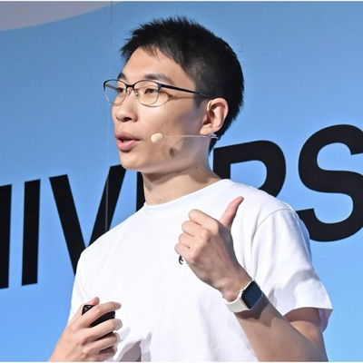

# William Zhang

**AI GTM Lead at GitHub**

I help enterprises connect AI strategy, implementation, and sustained adoption
through GitHub Copilot, better developer experience, and practical technical
enablement.

### Focus

- **Enterprise AI and GitHub Copilot** — moving from experimentation to
  responsible, repeatable adoption
- **Developer and field experience** — connecting product capabilities with
  real engineering workflows and customer needs
- **Scalable workshops and enablement** — creating practical learning paths
  that teams can apply and extend

[LinkedIn](https://www.linkedin.com/in/moulongzhang) ·
[X](https://x.com/moulongzhang) ·
[GitHub](https://github.com/moulongzhang)

BMath in Statistics, University of Waterloo · Japanese / English / Chinese
